# 🌾 Community Engagement Platform

> *A sophisticated Scala-based community management system for food security collaboration*

An advanced community management system built with Scala, focusing on food security collaboration and supporting UN Sustainable Development Goal 2 (Zero Hunger).

<div align="center">

[](https://scala-lang.org/) [](https://scalafx.org/) [](https://sqlite.org/) [](https://scala-sbt.org/)

</div>

---

## 📋 Table of Contents

- [🎯 Project Overview](#-project-overview)
- [🏗️ System Architecture](#️-system-architecture)
- [🔐 Security Features](#-security-features)
- [💾 Database Design](#-database-design)
- [🎨 User Interface](#-user-interface)
- [🔧 API & Middleware](#-api--middleware)
- [✨ Special Features](#-special-features)
- [📱 UI Showcase](#-ui-showcase)
- [🚀 Getting Started](#-getting-started)
- [👥 User Workflows](#-user-workflows)
- [📊 System Statistics](#-system-statistics)

---

## 🎯 Project Overview

### System Introduction

Community Engagement Platform is an enterprise-level community collaboration platform designed to promote food security cooperation among community members through technological solutions. The system adopts modern Scala functional programming paradigms combined with ScalaFX graphical interface framework to provide a complete community management solution.

### Core Values

- **🤝 Community Collaboration**: Promote neighborhood mutual assistance and build warm communities
- **🍽️ Food Security**: Reduce food waste and ensure food supply
- **📱 Digital Management**: Modern platform to improve collaboration efficiency
- **🌱 Sustainable Development**: Support UN SDG Goal 2 (Zero Hunger)

### Technology Stack

```scala
// Core Technology Stack
ScalaVersion := "3.3.4"
ScalaFXVersion := "21.0.0-R32"
SQLiteVersion := "3.43.2.2"
JavaFXVersion := "21.0.4"

// Third-party Libraries
libraryDependencies ++= Seq(
  "org.scalafx" %% "scalafx" % "21.0.0-R32",
  "com.github.nscala-time" %% "nscala-time" % "2.32.0",
  "org.json4s" %% "json4s-native" % "4.0.6",
  "org.xerial" % "sqlite-jdbc" % "3.43.2.2"
)
```

---

## 🏗️ System Architecture

### Layered Architecture Design

```
┌─────────────────────────────────────────────────────┐
│                   GUI Layer                         │
│  ┌─────────────┐ ┌─────────────┐ ┌─────────────┐    │
│  │   Scenes    │ │ Components  │ │   Dialogs   │    │
│  └─────────────┘ └─────────────┘ └─────────────┘    │
├─────────────────────────────────────────────────────┤
│                 Service Layer                       │
│  ┌─────────────┐ ┌─────────────┐ ┌─────────────┐    │
│  │ Community   │ │  Activity   │ │    OTP      │    │
│  │  Service    │ │    Feed     │ │  Service    │    │
│  └─────────────┘ └─────────────┘ └─────────────┘    │
├─────────────────────────────────────────────────────┤
│                Manager Layer                        │
│  ┌─────────────┐ ┌─────────────┐ ┌─────────────┐    │
│  │    User     │ │  FoodStock  │ │ Notification│    │
│  │  Manager    │ │  Manager    │ │   Manager   │    │
│  └─────────────┘ └─────────────┘ └─────────────┘    │
├─────────────────────────────────────────────────────┤
│              Database Layer                         │
│  ┌─────────────┐ ┌─────────────┐ ┌─────────────┐    │
│  │ Database    │ │     DAO     │ │   SQLite    │    │
│  │  Service    │ │   Layer     │ │  Database   │    │
│  └─────────────┘ └─────────────┘ └─────────────┘    │
└─────────────────────────────────────────────────────┘
```

### Package Structure Details

#### 🎯 Model Package (`src/main/scala/model/`)

```scala
model/
├── User.scala                 // Abstract user base class and subclasses
├── Announcement.scala         // Announcement model with likes and moderation
├── FoodPost.scala            // Food sharing posts
├── FoodStock.scala           // Food inventory management
├── DiscussionTopic.scala     // Discussion topics and replies
├── Event.scala               // Community event management
└── ActivityFeedItem.scala    // Activity feed items
```

#### 🔧 Manager Package (`src/main/scala/manager/`)

```scala
manager/
├── UserManager.scala             // User registration, authentication & management
├── FoodStockManager.scala        // Food inventory operations management
├── FoodPostManager.scala         // Food post management operations
├── StockMovementManager.scala    // Inventory movement records
├── NotificationManager.scala     // Notification distribution management
├── EventManager.scala            // Event creation and management
├── DiscussionForumManager.scala  // Discussion forum management
└── AnnouncementBoard.scala       // Announcement board management
```

#### 🌐 Service Package (`src/main/scala/service/`)

```scala
service/
├── CommunityEngagementService.scala  // Main service coordination layer
├── CommunityEngagementServiceNew.scala // New service implementation
├── ActivityFeedService.scala         // Activity feed service
└── OTPService.scala                   // OTP verification service
```

#### 🎨 GUI Package (`src/main/scala/gui/`)

```scala
gui/
├── ModularCommunityEngagementApp.scala  // Modular main application
├── CommunityEngagementApp.scala         // Traditional monolithic application
├── scenes/
│   └── SceneManager.scala               // Scene manager
├── components/
│   ├── layout/                          // Layout components
│   │   ├── MainTabPane.scala           // Main application tab pane
│   │   ├── AnonymousMainTabPane.scala  // Anonymous mode tab pane
│   │   ├── MenuBarComponent.scala      // Main menu bar
│   │   ├── AnonymousMenuBarComponent.scala  // Anonymous menu bar
│   │   └── TabPaneComponent.scala      // Generic tab pane component
│   ├── features/                        // Feature-specific components
│   │   ├── activityfeed/               // Activity feed components
│   │   ├── announcements/              // Announcement components
│   │   ├── anonymous/                  // Anonymous mode components
│   │   ├── discussion/                 // Discussion forum components
│   │   ├── events/                     // Event management components
│   │   ├── food/                       // Food sharing components
│   │   ├── foodstock/                  // Food stock components
│   │   ├── info/                       // Information components
│   │   └── notifications/              // Notification components
│   ├── dashboards/                      // Dashboard components
│   │   ├── UserDashboard.scala        // User dashboard
│   │   └── AdminDashboard.scala       // Administrator dashboard
│   └── common/                          // Common/shared components
│       ├── public/                     // Public utility components
│       ├── datepicker/                 // Date picker components
│       └── user/                       // User-specific components
├── dialogs/
│   ├── auth/                           // Authentication dialogs
│   │   ├── FacebookStyleAuthDialog.scala  // Main authentication dialog
│   │   └── OTPVerificationDialog.scala   // OTP verification dialog
│   ├── features/                       // Feature dialogs
│   │   ├── announcements/              // Announcement creation dialogs
│   │   ├── discussion/                 // Discussion dialogs
│   │   ├── events/                     // Event creation dialogs
│   │   ├── food/                       // Food sharing dialogs
│   │   └── foodstock/                  // Stock management dialogs
│   ├── admin/                          // Admin dialogs
│   │   └── AdminDialogs.scala         // Administrative dialogs
│   ├── common/                         // Common dialogs
│   │   ├── CommentDialog.scala        // Comment creation dialog
│   │   └── ProfileDialog.scala        // User profile dialog
│   └── package.scala                   // Package object definitions
└── utils/
    └── GuiUtils.scala                  // GUI utility classes
```

#### 💾 Database Package (DAO = Data Access Object) (`src/main/scala/database/`)

```scala
database/
├── DatabaseConnection.scala     // Database connection management
├── DatabaseSchema.scala         // Database schema and initialization
├── dao/                         // Data Access Objects
│   ├── UserDAO.scala           // User data access
│   ├── AnnouncementDAO.scala   // Announcement data access
│   ├── FoodPostDAO.scala       // Food post data access
│   ├── FoodStockDAO.scala      // Food stock data access
│   ├── EventDAO.scala          // Event data access
│   ├── DiscussionTopicDAO.scala // Discussion topic data access
│   ├── DiscussionReplyDAO.scala // Discussion reply data access
│   └── StockMovementDAO.scala  // Stock movement data access
└── service/
    └── DatabaseService.scala   // Database service layer
```

#### 🔧 Util Package (`src/main/scala/util/`)

```scala
util/
└── PasswordHasher.scala  // Password encryption utilities
```

#### 🧪 Test Package (`src/main/scala/test/`)

```scala
test/
└── PasswordHashTest.scala  // Password hashing unit tests
```

---

## 🔐 Security Features

### 🔒 Dual Password Encryption System

#### SHA-256 + Salt Encryption Mechanism

```scala
object PasswordHasher {
  private val ALGORITHM = "SHA-256"
  private val SALT_LENGTH = 32        // 32-byte random salt
  private val ITERATIONS = 10000      // 10,000 iteration encryption
  
  def hashPassword(password: String): String = {
    val salt = generateSalt()
    val hash = hashPasswordWithSalt(password, salt)
    s"$salt:$hash"  // Format: salt:hash
  }
}
```

**Security Features**:

- 🧂 **Random Salt**: Each password uses 32-byte random salt
- 🔄 **Multiple Iterations**: 10,000 rounds of SHA-256 iteration encryption
- ⏱️ **Timing Attack Protection**: Uses MessageDigest.isEqual for constant-time comparison
- 💾 **Secure Storage**: Passwords stored in "salt:hash" format

#### Password Complexity Validation

```scala
def isPasswordValid(password: String): Boolean = {
  password.length >= 8 && 
  password.exists(_.isDigit) && 
  password.exists(_.isLetter) &&
  password.exists(c => !c.isLetterOrDigit)
}
```

**Validation Rules**:

- ✅ Minimum 8 characters
- ✅ At least one digit
- ✅ At least one letter
- ✅ At least one special character

### 📧 Email OTP Verification System

#### OTP Generation and Verification Process

```scala
class OTPService {
  def generateOTP(): String = {
    val random = new Random()
    (100000 + random.nextInt(900000)).toString  // 6-digit verification code
  }
  
  def simulateEmailSending(email: String, otp: String): Unit = {
    // Email sending interface simulation, showing complete email content
    Platform.runLater {
      showEmailSimulationDialog(email, otp)
    }
  }
}
```

**OTP Features**:

- 🔢 **6-digit Code**: Range 100000-999999
- ⏰ **Time Validity**: 10 minutes validity period
- 📧 **Email Simulation**: Complete email interface display
- 🔄 **Resend Mechanism**: Support for verification code resend

### 👤 Guest Mode and Login Mode

#### Dual Mode Architecture Design

```scala
class SceneManager {
  def showAnonymousScene(): Unit = {
    service.enableAnonymousMode()
    // Anonymous mode interface - read-only access
  }
  
  def showMainScene(): Unit = {
    service.disableAnonymousMode()
    // Full functionality interface - read-write access
  }
}
```

**Mode Features**:

- 🔓 **Guest Mode**: Read-only access, can view all content
- 🔑 **Login Mode**: Full functionality, can create and interact
- 🔄 **Seamless Switching**: Runtime mode switching
- 💡 **Guidance Mechanism**: Guest mode prompts login for more features

---

## 💾 Database Design

### 📊 Database Architecture Diagram

```sql
-- Users table (Core table)
CREATE TABLE users (
    user_id TEXT PRIMARY KEY,
    username TEXT UNIQUE NOT NULL,
    email TEXT UNIQUE NOT NULL,
    name TEXT NOT NULL,
    contact_info TEXT,
    is_admin BOOLEAN DEFAULT 0,
    password_hash TEXT NOT NULL,  -- SHA-256 + Salt
    created_at TEXT DEFAULT CURRENT_TIMESTAMP,
    updated_at TEXT DEFAULT CURRENT_TIMESTAMP
);

-- Announcements table
CREATE TABLE announcements (
    announcement_id TEXT PRIMARY KEY,
    author_id TEXT NOT NULL,
    title TEXT NOT NULL,
    content TEXT NOT NULL,
    announcement_type TEXT NOT NULL,
    is_moderated BOOLEAN DEFAULT 0,
    moderator_id TEXT,
    likes INTEGER DEFAULT 0,
    created_at TEXT DEFAULT CURRENT_TIMESTAMP,
    updated_at TEXT DEFAULT CURRENT_TIMESTAMP,
    FOREIGN KEY (author_id) REFERENCES users(user_id)
);

-- Food posts table
CREATE TABLE food_posts (
    post_id TEXT PRIMARY KEY,
    author_id TEXT NOT NULL,
    title TEXT NOT NULL,
    description TEXT NOT NULL,
    post_type TEXT NOT NULL,      -- OFFER/REQUEST
    quantity TEXT NOT NULL,
    location TEXT NOT NULL,
    expiry_date TEXT,
    status TEXT DEFAULT 'PENDING', -- PENDING/ACCEPTED/COMPLETED
    accepted_by TEXT,
    is_moderated BOOLEAN DEFAULT 0,
    likes INTEGER DEFAULT 0,
    created_at TEXT DEFAULT CURRENT_TIMESTAMP,
    FOREIGN KEY (author_id) REFERENCES users(user_id)
);

-- Food stocks table
CREATE TABLE food_stocks (
    stock_id TEXT PRIMARY KEY,
    food_name TEXT NOT NULL,
    category TEXT NOT NULL,       -- FRUITS/VEGETABLES/GRAINS etc.
    current_quantity REAL DEFAULT 0,
    unit TEXT NOT NULL,
    minimum_threshold REAL DEFAULT 0,
    expiry_date TEXT,
    is_packaged BOOLEAN DEFAULT 0,
    location TEXT DEFAULT 'Main Storage',
    last_modified_by TEXT,
    last_modified_date TEXT DEFAULT CURRENT_TIMESTAMP,
    created_at TEXT DEFAULT CURRENT_TIMESTAMP
);

-- Stock movements table
CREATE TABLE stock_movements (
    movement_id TEXT PRIMARY KEY,
    stock_id TEXT NOT NULL,
    action_type TEXT NOT NULL,    -- STOCK_IN/STOCK_OUT/ADJUSTMENT
    quantity REAL NOT NULL,
    previous_quantity REAL NOT NULL,
    new_quantity REAL NOT NULL,
    user_id TEXT NOT NULL,
    notes TEXT DEFAULT '',
    timestamp TEXT DEFAULT CURRENT_TIMESTAMP,
    FOREIGN KEY (stock_id) REFERENCES food_stocks(stock_id)
);

-- Discussion topics table
CREATE TABLE discussion_topics (
    topic_id TEXT PRIMARY KEY,
    author_id TEXT NOT NULL,
    title TEXT NOT NULL,
    description TEXT NOT NULL,
    category TEXT NOT NULL,       -- NUTRITION/SUSTAINABLE_AGRICULTURE etc.
    is_moderated BOOLEAN DEFAULT 0,
    likes INTEGER DEFAULT 0,
    created_at TEXT DEFAULT CURRENT_TIMESTAMP,
    FOREIGN KEY (author_id) REFERENCES users(user_id)
);

-- Events table
CREATE TABLE events (
    event_id TEXT PRIMARY KEY,
    organizer_id TEXT NOT NULL,
    title TEXT NOT NULL,
    description TEXT NOT NULL,
    location TEXT NOT NULL,
    start_datetime TEXT NOT NULL,
    end_datetime TEXT NOT NULL,
    max_participants INTEGER,
    likes INTEGER DEFAULT 0,
    created_at TEXT DEFAULT CURRENT_TIMESTAMP,
    FOREIGN KEY (organizer_id) REFERENCES users(user_id)
);

-- Notifications table
CREATE TABLE notifications (
    notification_id TEXT PRIMARY KEY,
    recipient_id TEXT NOT NULL,
    sender_id TEXT,
    type TEXT NOT NULL,           -- ANNOUNCEMENT/FOOD_POST/EVENT etc.
    title TEXT NOT NULL,
    message TEXT NOT NULL,
    related_id TEXT,              -- Related content ID
    is_read BOOLEAN DEFAULT 0,
    created_at TEXT DEFAULT CURRENT_TIMESTAMP,
    FOREIGN KEY (recipient_id) REFERENCES users(user_id)
);
```

### 🔍 Data Access Layer (DAO)

#### Generic DAO Pattern

```scala
trait BaseDAO[T] {
  def insert(entity: T): Boolean
  def findById(id: String): Option[T]
  def findAll(): List[T]
  def update(entity: T): Boolean
  def delete(id: String): Boolean
}

class UserDAO extends BaseDAO[User] {
  def authenticateUser(username: String, password: String): Option[User] = {
    // Secure user authentication logic
  }
  
  def findByUsername(username: String): Option[User] = {
    // Find user by username
  }
}
```

## 🎨 User Interface

### 🏠 Main Interface Tab System

#### Tab Structure Design

```scala
class MainTabPane extends BaseComponent {
  override def build(): Region = {
    new TabPane {
      tabs = Seq(
        new DashboardComponent().build(),      // 🏠 Dashboard
        new AnnouncementsTab().build(),        // 📢 Announcements
        new FoodSharingTab().build(),          // 🍽️ Food Sharing
        new FoodStockTab().build(),            // 📦 Stock Management
        new DiscussionTab().build(),           // 💬 Discussion Forum
        new EventsTab().build(),               // 📅 Events
        new NotificationsTab().build(),        // 🔔 Notifications
        new AppInfoTab().build()               // ℹ️ App Information
      )
    }
  }
}
```

### 🔧 Component Architecture

#### Base Component System

```scala
trait BaseComponent {
  def build(): Region
  def refresh(): Unit = {}
  def initialize(): Unit = {}
}

trait BaseTabComponent extends BaseComponent {
  protected val service = CommunityEngagementService.getInstance
  
  def build(): Tab
}
```

#### Common Component Builder

```scala
object SimpleComponentBuilder {
  def button(text: String, action: () => Unit): Button = new Button(text) {
    onAction = _ => action()
    style = "-fx-background-color: #007bff; -fx-text-fill: white;"
  }
  
  def searchBox(prompt: String, width: Double): TextField = new TextField {
    promptText = prompt
    prefWidth = width
    style = "-fx-border-color: #ced4da; -fx-border-radius: 4;"
  }
  
  def listView[T](width: Double, height: Double): ListView[T] = new ListView[T] {
    prefWidth = width
    prefHeight = height
    style = "-fx-border-color: #dee2e6; -fx-border-width: 1;"
  }
}
```

### 🎨 Themes and Styling

#### Modern UI Design

```scala
object StyleConstants {
  val PRIMARY_COLOR = "#007bff"
  val SUCCESS_COLOR = "#28a745"
  val WARNING_COLOR = "#ffc107"
  val DANGER_COLOR = "#dc3545"
  val INFO_COLOR = "#17a2b8"
  
  val CARD_STYLE = "-fx-background-color: white; -fx-border-color: #dee2e6; " +
                   "-fx-border-width: 1; -fx-border-radius: 8; " +
                   "-fx-effect: dropshadow(gaussian, rgba(0,0,0,0.1), 5, 0, 0, 2);"
}
```

---

## 🔧 API & Middleware

### 🌐 Service Layer API Design

#### Core Service Interface

```scala
class CommunityEngagementService {
  private var currentUser: Option[User] = None
  private var isAnonymousMode: Boolean = false
  private val dbService = new DatabaseService()
  
  // User Management API
  def login(username: String, password: String): Option[User]
  def logout(): Unit
  def registerUser(username: String, email: String, name: String, 
                  contact: String, password: String, isAdmin: Boolean): Boolean
  
  // Content Management API
  def createAnnouncement(title: String, content: String, 
                        announcementType: AnnouncementType): Option[Announcement]
  def createFoodPost(title: String, description: String, postType: FoodPostType,
                    quantity: String, location: String, 
                    expiryDate: Option[LocalDateTime]): Option[FoodPost]
  def createEvent(title: String, description: String, location: String,
                 startDateTime: LocalDateTime, endDateTime: LocalDateTime,
                 maxParticipants: Option[Int]): Option[Event]
  
  // Query API
  def getAnnouncements: List[Announcement]
  def getFoodPosts: List[FoodPost]
  def getUpcomingEvents: List[Event]
  def getDiscussionTopics: List[DiscussionTopic]
  
  // Search API
  def searchAnnouncements(searchTerm: String): List[Announcement]
  def searchFoodPosts(searchTerm: String): List[FoodPost]
  def searchEvents(searchTerm: String): List[Event]
}
```

### 🔄 Activity Feed Service

#### Real-time Activity Stream

```scala
class ActivityFeedService(dbService: DatabaseService) {
  def getActivityFeed(filterType: Option[ActivityFeedType] = None): List[ActivityFeedItem] = {
    val feedItems = ListBuffer[ActivityFeedItem]()
  
    // Announcement activities
    val announcements = dbService.getRecentAnnouncements()
    announcements.foreach { announcement =>
      feedItems += ActivityFeedItem.fromAnnouncement(announcement, authorName)
    }
  
    // Food post activities
    val foodPosts = dbService.getActiveFoodPosts()
    foodPosts.foreach { foodPost =>
      feedItems += ActivityFeedItem.fromFoodPost(foodPost, authorName)
    }
  
    // Event information
    val events = dbService.getUpcomingEvents()
    events.foreach { event =>
      feedItems += ActivityFeedItem.fromEvent(event, organizerName)
    }
  
    feedItems.sortBy(_.timestamp).reverse.toList
  }
}
```

### 📧 OTP Email Service

#### Email Verification Middleware

```scala
class OTPService {
  def sendVerificationEmail(email: String): String = {
    val otpCode = generateOTP()
    simulateEmailSending(email, otpCode)
    otpCode
  }
  
  private def simulateEmailSending(email: String, otp: String): Unit = {
    // Display complete email interface simulation
    Platform.runLater {
      val emailDialog = new Stage {
        title = "📧 Email Notification"
        // Complete email interface implementation
      }
    }
  }
}
```

---

## ✨ Special Features

### 🔐 Dual Mode Authentication System

#### Facebook-style Authentication Dialog

```scala
class FacebookStyleAuthDialog(parentStage: Stage) {
  enum AuthMode:
    case WelcomeMode, LoginMode, RegisterMode
  
  enum AuthResult:
    case LoginSuccess, RegisterSuccess, ContinueAsGuest, Cancelled
  
  def show(): AuthResult = {
    // Show welcome interface
    showWelcomeMode()
    // Handle user choice
    handleUserChoice()
  }
}
```

**Authentication Features**:

- 🎨 **Modern UI**: Facebook-style authentication interface
- 🔄 **Mode Switching**: Seamless switching between login/register/guest modes
- ✅ **Real-time Validation**: Real-time validation status display during input
- 📧 **Email Verification**: Integrated OTP email verification process

### 📊 Intelligent Dashboard

#### User Dashboard

```scala
class UserDashboard {
  def build(): Tab = {
    val personalStatsSection = createPersonalStatsSection()
    val communityHighlightsSection = createCommunityHighlightsSection()
    val personalActivitySection = createPersonalActivitySection()
    val communityInteractionSection = createCommunityInteractionSection()
  
    // Responsive layout
  }
}
```

#### Admin Dashboard

```scala
class AdminDashboard {
  def build(): Tab = {
    val systemOverviewSection = createSystemOverviewSection()
    val userManagementSection = createUserManagementSection()
    val contentModerationSection = createContentModerationSection()
    val systemControlsSection = createSystemControlsSection()
  
    // Administrative function panel
  }
}
```

### 🍽️ Food Stock Management

#### Stock Management System

```scala
class FoodStockManager extends Manager[FoodStock] {
  def addStock(foodStock: FoodStock): String = {
    val stockId = add(foodStock.stockId, foodStock)
    recordStockMovement(stockId, "STOCK_IN", foodStock.currentQuantity)
    stockId
  }
  
  def updateStock(stockId: String, newQuantity: Double, userId: String): Boolean = {
    findById(stockId) match {
      case Some(stock) =>
        val previousQty = stock.currentQuantity
        stock.currentQuantity = newQuantity
        recordStockMovement(stockId, "ADJUSTMENT", newQuantity - previousQty)
        true
      case None => false
    }
  }
  
  def getLowStockAlerts: List[FoodStock] = {
    items.values.filter(stock => 
      stock.currentQuantity <= stock.minimumThreshold
    ).toList
  }
}
```

### 💬 Enhanced Activity Feed

#### Activity Feed Component

```scala
class EnhancedActivityFeedComponent(
  service: CommunityEngagementService,
  onRefresh: () => Unit,
  filterType: Option[ActivityFeedType] = None
) {
  def build(): VBox = {
    val activityItems = getFilteredActivityItems()
  
    new VBox {
      spacing = 15
      children = activityItems.map(createActivityCard)
    }
  }
  
  private def createActivityCard(item: ActivityFeedItem): VBox = {
    // Create beautiful activity cards
  }
}
```

---

## 📱 UI Showcase

### 🏠 Main Interface

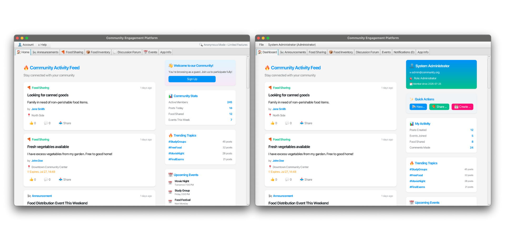

```
Main Interface Features:
✅ Responsive tab layout
✅ Unified navigation bar
✅ Real-time status indicators
✅ User information display
```

### 🔐 Authentication Interface

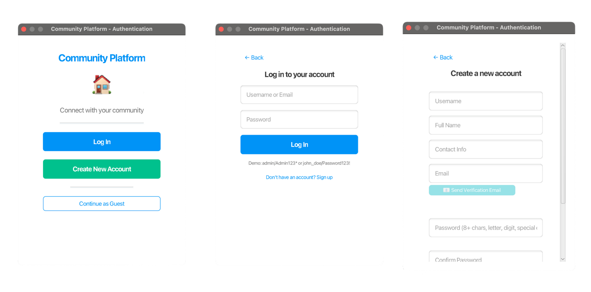

```
Authentication Interface Features:
✅ Modern design style
✅ Real-time input validation
✅ Password strength indicator
✅ OTP email verification
```

### 📧 OTP Verification Interface

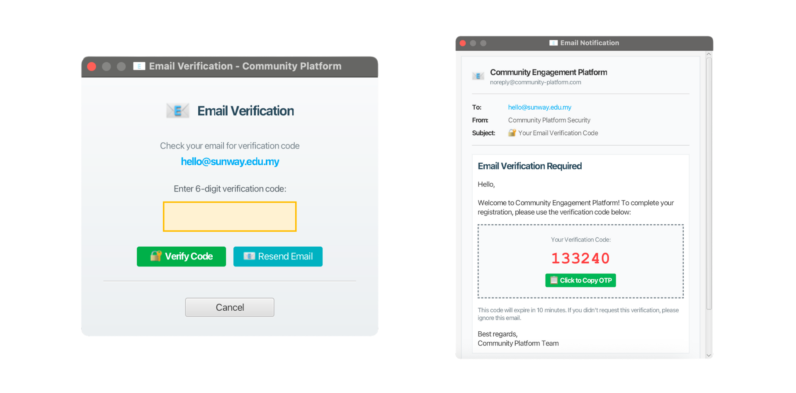

```
OTP Interface Features:
✅ Complete email simulation
✅ One-click copy verification code
✅ Resend verification code function
✅ Countdown display
```

### 📊 User Dashboard

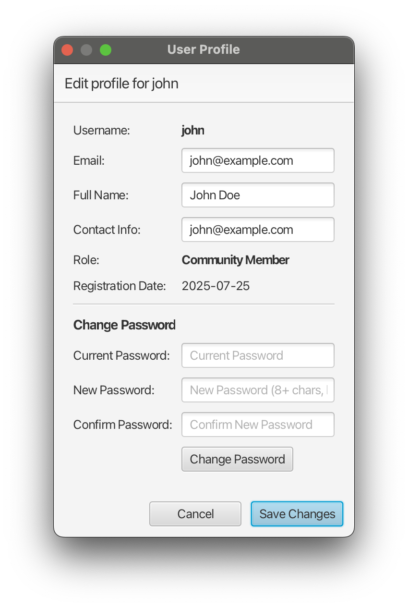

```
Dashboard Features:
✅ Personal statistics
✅ Community activity updates
✅ Quick action buttons
✅ Trend data display
```

### 🔧 Admin Panel

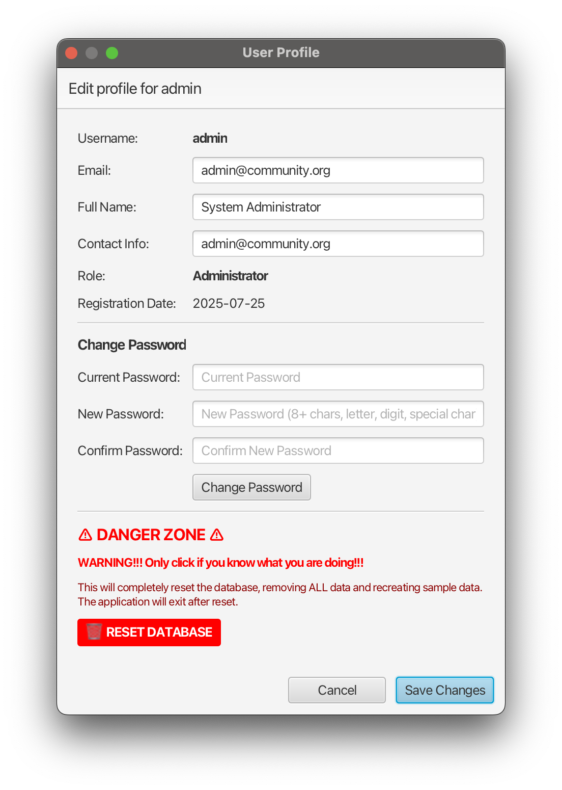

```
Admin Panel Features:
✅ System overview statistics
✅ User management tools
✅ Content moderation functions
✅ System control options
```

### 🍽️ Food Sharing Interface

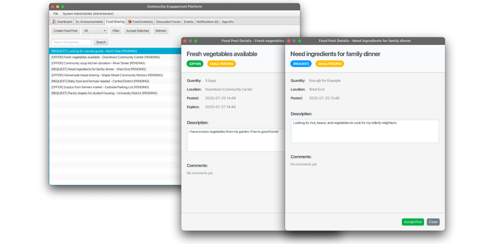

```
Food Sharing Features:
✅ Post food supply and demand information
✅ Search and filter functions
✅ Status tracking system
✅ Detailed information viewing
```

### 📦 Stock Management Interface

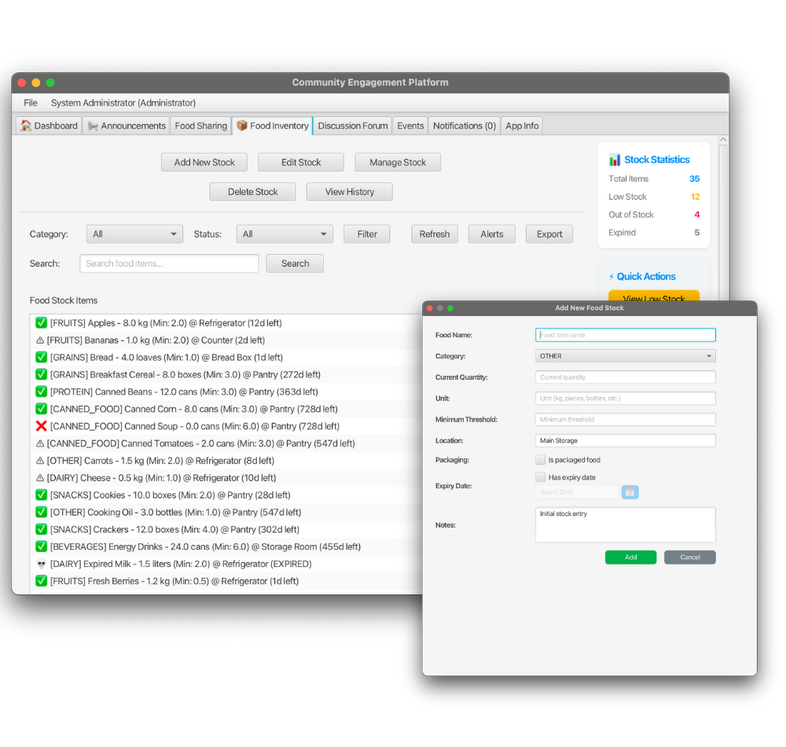

```
Stock Management Features:
✅ Real-time stock monitoring
✅ Low stock alerts
✅ Stock movement records
✅ Batch operation support
```

### 💬 Discussion Forum Interface

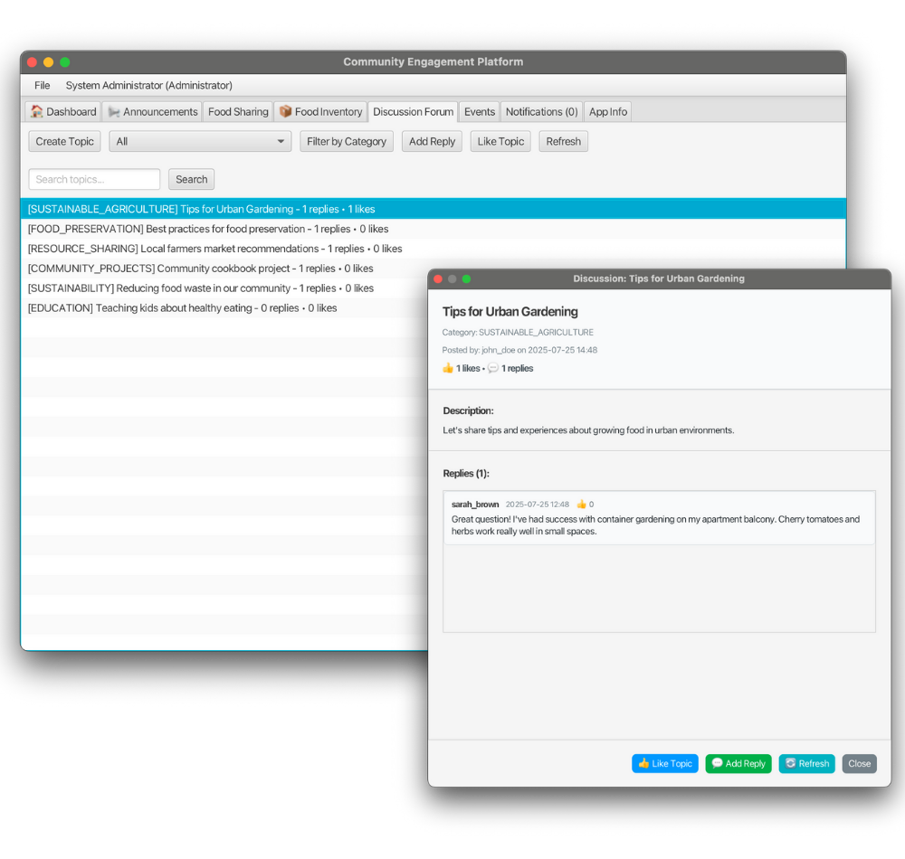

```
Forum Features:
✅ Categorized discussion topics
✅ Reply and like functions
✅ Real-time interaction system
✅ Content moderation mechanism
```

### 📅 Event Management Interface

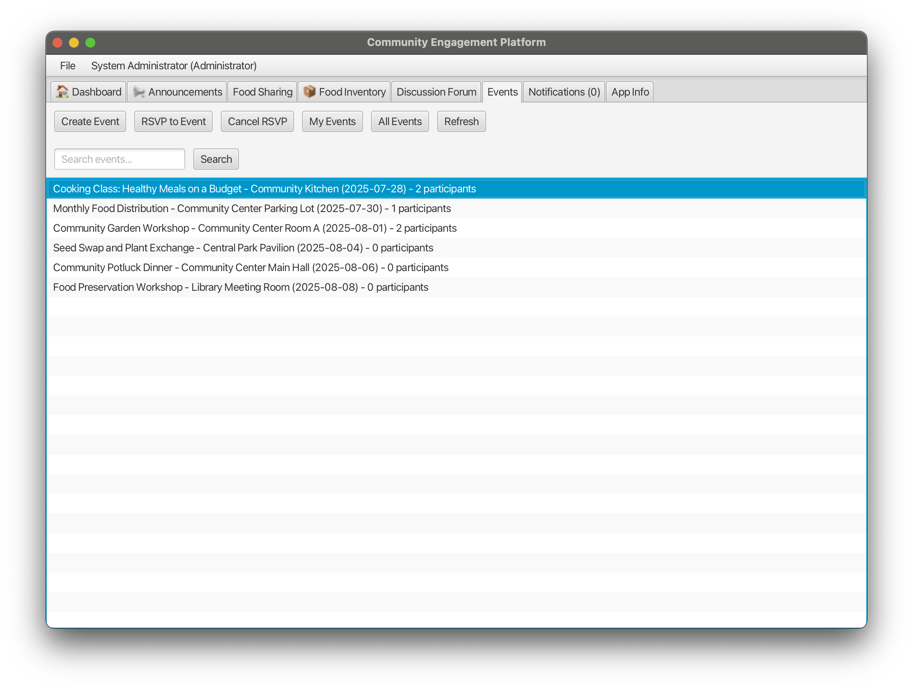

```
Event Management Features:
✅ Event creation and editing
✅ RSVP registration system
✅ Participant management
✅ Event status tracking
```

## 🚀 Getting Started

### 📋 System Requirements

#### Development Environment

```bash
# Required Software
JDK 21+                    # Java Development Kit
Scala 3.3.4               # Scala Programming Language
SBT 1.9.0+                # Scala Build Tool
SQLite 3.43.2+            # Lightweight Database

# Recommended IDEs
IntelliJ IDEA             # Highly Recommended
VS Code + Metals          # Lightweight Option
```

### 🔧 Installation Steps

#### 1. Clone Project

```bash
git clone https://github.com/KevinTan2025/final-project-KevinTan2025.git
cd final-project-KevinTan2025
```

#### 2. Verify Environment

```bash
# Check Java version
java -version   # Should display 21.x.x

# Check Scala version
scala -version  # Should display 3.3.4

# Check SBT version
sbt version     # Should display 1.9.x
```

#### 3. Compile Project

```bash
# Clean and compile
sbt clean compile

# Download dependencies
sbt update
```

#### 4. Run Application

```bash
# Start application
sbt run

# Or use task
sbt "runMain MyApp"
```

### 🎯 Quick Experience

#### Preset Accounts

```scala
// Administrator accounts
Username: admin
Password: Admin123*

Username: community_manager  
Password: Admin123*

// Regular user accounts
Username: john
Password: Password123!

Username: jane
Password: Password123!
```

#### Feature Tour

1. **🔓 Guest Mode**: Experience read-only features immediately after startup
2. **🔑 Login Mode**: Click login to access full functionality
3. **📧 Registration Process**: Experience OTP email verification
4. **🍽️ Food Sharing**: Post and accept food information
5. **💬 Community Discussion**: Participate in topic discussions
6. **📅 Event Management**: Create and participate in community events

---

## 👥 User Workflows

### 🆕 New User Registration Process

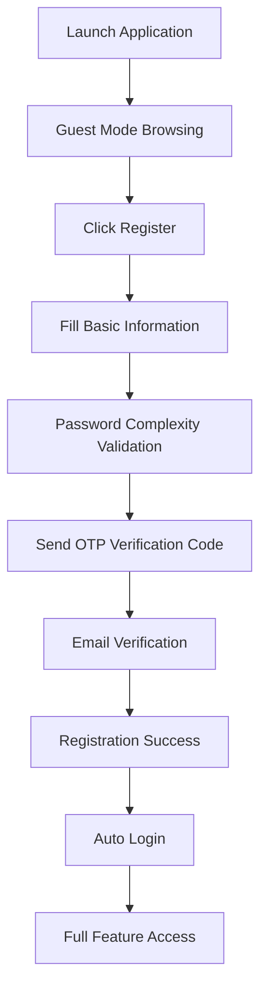

#### Detailed Step Description

1. **Application Launch**: System automatically enters Guest mode
2. **Information Browsing**: Can view all public content
3. **Registration Trigger**: Click any "login required" feature
4. **Form Filling**:
   - Real-time username availability check
   - Email format validation
   - Real-time password strength display
5. **OTP Verification**:
   - Send 6-digit verification code
   - Complete email interface simulation
   - Verification code valid for 10 minutes
6. **Account Activation**: Automatic login after successful verification

### 🍽️ Food Sharing Process

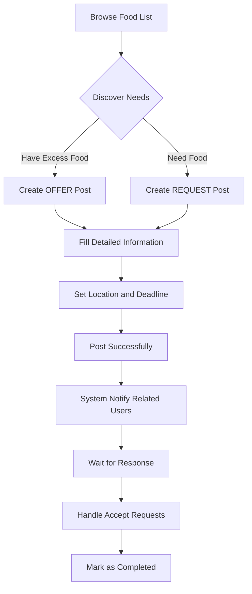

### 💬 Community Discussion Participation

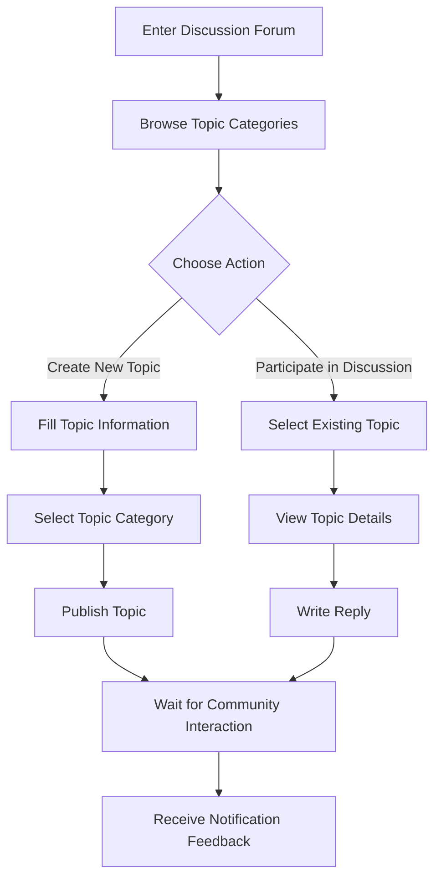

### 📅 Event Organization Process

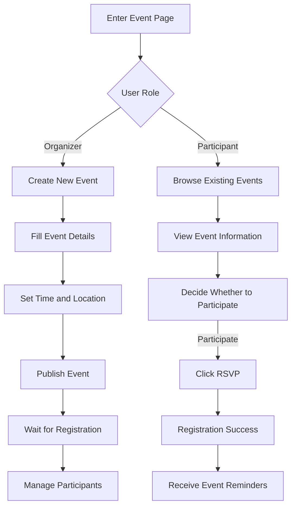

---

## 📊 System Statistics

### 📈 Project Scale Statistics

#### Code Line Count Statistics

```
Total Code Files: 82 Scala files
├── Model Layer: 8 files (~2,000 lines)
├── Manager Layer: 8 files (~2,400 lines) 
├── Service Layer: 4 files (~2,800 lines)
├── GUI Layer: 48 files (~15,000 lines)
├── Database Layer: 11 files (~2,500 lines)
├── Util Layer: 1 file (~200 lines)
├── Test Layer: 1 file (~100 lines)
└── Root Files: 1 file (~50 lines)

Total: ~25,050 lines of Scala code
```

#### Database Table Structure

```sql
-- Core Data Tables: 12 tables
├── users (users table)
├── announcements (announcements table) 
├── food_posts (food posts table)
├── food_stocks (food stocks table)
├── stock_movements (stock movements table)
├── discussion_topics (discussion topics table)
├── discussion_replies (discussion replies table)
├── events (events table)
├── event_rsvps (event RSVPs table)
├── notifications (notifications table)
├── comments (comments table)
└── Performance optimization indexes: 15 indexes
```

#### Functional Module Statistics

```
🎯 Core Functional Modules: 8 modules
├── 🔐 User Authentication System (Authentication)
├── 📢 Announcement Management System (Announcements) 
├── 🍽️ Food Sharing System (Food Sharing)
├── 📦 Stock Management System (Stock Management)
├── 💬 Discussion Forum System (Discussion Forum)
├── 📅 Event Management System (Event Management)
├── 🔔 Notification System (Notification System)
└── 📊 Data Analytics System (Analytics Dashboard)
```

### 🔧 Technical Architecture Statistics

#### Design Pattern Applications

```scala
// Applied Design Patterns
✅ Singleton Pattern (Service Singleton)
✅ Factory Pattern (User Factory)
✅ Observer Pattern (Notification System)
✅ Strategy Pattern (Role Permissions)
✅ Builder Pattern (Component Construction)
✅ DAO Pattern (Data Access)
✅ MVC Pattern (Interface Architecture)
✅ Template Method Pattern (Base Components)
```

#### OOP Principles Implementation

```scala
// Object-Oriented Features
✅ Inheritance: User -> CommunityMember/AdminUser
✅ Polymorphism: Method overriding for different user types
✅ Encapsulation: Private fields with public accessors
✅ Abstraction: Abstract user classes and manager traits
✅ Composition: Service layer composing data layer
✅ Generics: Manager[T] type-safe collection management
```

### 🛡️ Security Features

#### Security Measures Statistics

```
🔐 Password Security:
├── SHA-256 algorithm encryption
├── 32-byte random salt
├── 10,000 iteration encryption
└── Timing attack protection

📧 OTP Verification:
├── 6-digit random numeric code
├── 10-minute validity period
├── Email interface simulation
└── Resend verification function

👤 Access Control:
├── Guest mode (read-only)
├── User mode (read-write)
├── Admin mode (management)
└── Real-time permission checks
```

### 🎨 User Experience Features

#### UI/UX Feature Statistics

```
🎨 Interface Design:
├── Responsive layout design
├── Modern card style
├── Unified color scheme
├── Intuitive icon system
└── Accessibility support

🔄 Interaction Experience:
├── Real-time form validation
├── Smart search suggestions
├── Drag-and-drop operations
├── Keyboard shortcut support
└── Undo/redo functionality

📱 Cross-platform Support:
├── Windows native support
├── macOS compatibility (Intel/ARM)
├── Linux distribution support
└── Automatic platform detection
```

## 📜 Project Summary

### 🎓 Learning Achievement Showcase

#### Object-Oriented Programming Mastery

This project comprehensively demonstrates the practical application of OOP core concepts:

- **Inheritance Hierarchy**: `User` → `CommunityMember`/`AdminUser` abstract base class design
- **Polymorphism Implementation**: Method overriding and dynamic dispatch for different user roles
- **Encapsulation Principle**: Data protection through private fields with public accessors
- **Abstraction Design**: Reasonable use of abstract classes and traits
- **Generic Programming**: `Manager[T]` type-safe collection management

#### Advanced Programming Skills

- **Functional Programming**: Writing concise code using Scala's functional features
- **Design Patterns**: Practical application of Singleton, Factory, Observer and other patterns
- **Exception Handling**: Comprehensive error handling and user-friendly exception messages
- **Concurrent Programming**: ScalaFX event-driven and asynchronous processing
- **Database Design**: Normalized relational database design

#### Software Engineering Practices

- **Modular Architecture**: Clear layered architecture and module responsibility separation
- **Code Standards**: Consistent naming conventions and code style
- **Complete Documentation**: Detailed Scaladoc and user documentation
- **Version Control**: Proper use of Git and commit history management
- **Project Management**: SBT build tool configuration and dependency management

### 🌟 Technical Highlights

#### Innovative Features

1. **Dual Mode Architecture**: Seamless switching between Guest/Login modes
2. **Security Authentication**: Dual password encryption and OTP verification system
3. **Real-time Activity Feed**: Dynamic community activity display
4. **Intelligent Inventory**: Inventory management and alert system
5. **Modular GUI**: Reusable component-based interface design

#### User Experience Optimization

1. **Intuitive Interface**: Modern user interface design
2. **Real-time Feedback**: Instant form validation and status updates
3. **Smooth Interaction**: Responsive design and animation effects
4. **Complete Process**: Complete user journey from registration to usage
5. **Error Handling**: Friendly error prompts and recovery mechanisms

### 🎯 Project Value

#### Educational Value

- **Theory and Practice Integration**: Applying OOP theory to actual projects
- **Complete Development Process**: Full process experience from requirement analysis to implementation deployment
- **Modern Tool Usage**: Mastering the use of modern development tools and frameworks
- **Team Collaboration Skills**: Cultivating collaboration skills through Git and documentation

#### Social Value

- **Community Building**: Promoting neighborhood mutual assistance and community cohesion
- **Resource Sharing**: Reducing food waste and improving resource utilization efficiency
- **Sustainable Development**: Supporting UN SDG Goal 2 (Zero Hunger)
- **Digital Transformation**: Providing modern solutions for traditional community activities

### 📊 Project Assessment

#### ✅ Completed Features

- [X]  Complete user management system
- [X]  Secure authentication and authorization mechanism
- [X]  Food sharing and demand posting
- [X]  Community discussion forum
- [X]  Event organization and participation
- [X]  Notification system
- [X]  Inventory management system
- [X]  Administrator function panel
- [X]  Responsive user interface
- [X]  Data persistence storage

#### 🎯 Achieved Learning Objectives

- [X]  **Class Definition Mastery**: Complete class definitions including fields, types, and constructors
- [X]  **Collection Class Design**: Collection class implementation for managing object groups
- [X]  **Inheritance Hierarchy**: Abstract base class and subclass inheritance relationships
- [X]  **Polymorphism**: Polymorphic behavior through method overriding
- [X]  **Abstract Classes and Traits**: Reasonable use of abstract classes and traits
- [X]  **Generic Programming**: Type-safe generic collection management
- [X]  **GUI Implementation**: ScalaFX-based graphical user interface
- [X]  **Third-party Library Integration**: Successful integration of multiple external libraries
- [X]  **Documentation Completeness**: Comprehensive Scaladoc and user documentation
- [X]  **Code Style**: Consistent naming conventions and code standards

---

## 📞 Contact Information

### 👨‍💻 Developer / Student Information

```
Developer: Kevin Tan
Course: PRG2104 - Object-Oriented Programming
Intake: April 2024
```

## 📜 Copyright Notice

```
Copyright (c) 2025 Kevin Tan
This project is developed for educational purposes only as a final assignment 
for Object-Oriented Programming course. All code follows academic integrity 
principles. Welcome to learn and communicate but please do not copy directly.
```

---

*🌟 Thank you for using Community Engagement Platform! This project represents an important milestone in my Object-Oriented Programming learning journey. Hope this platform can truly help communities build a better future together.*
